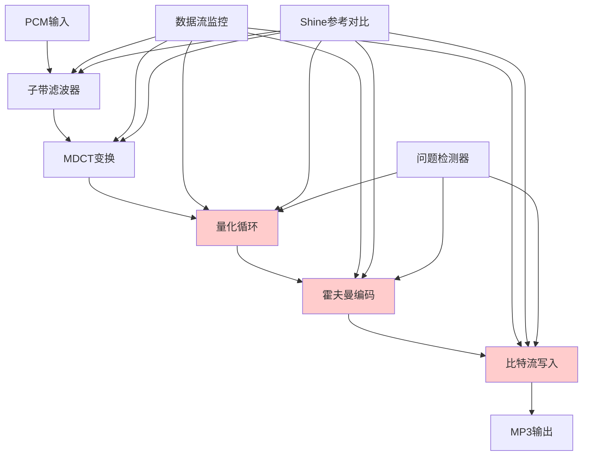
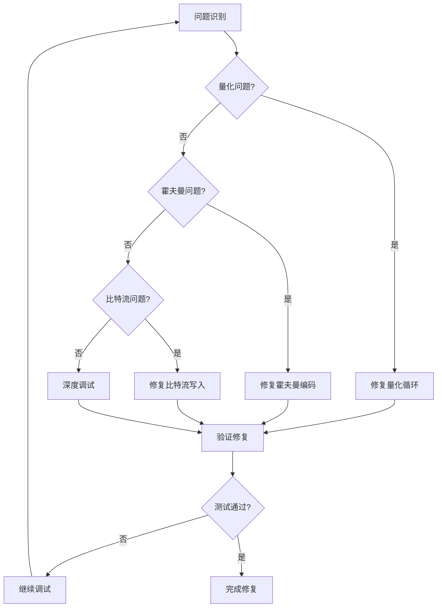
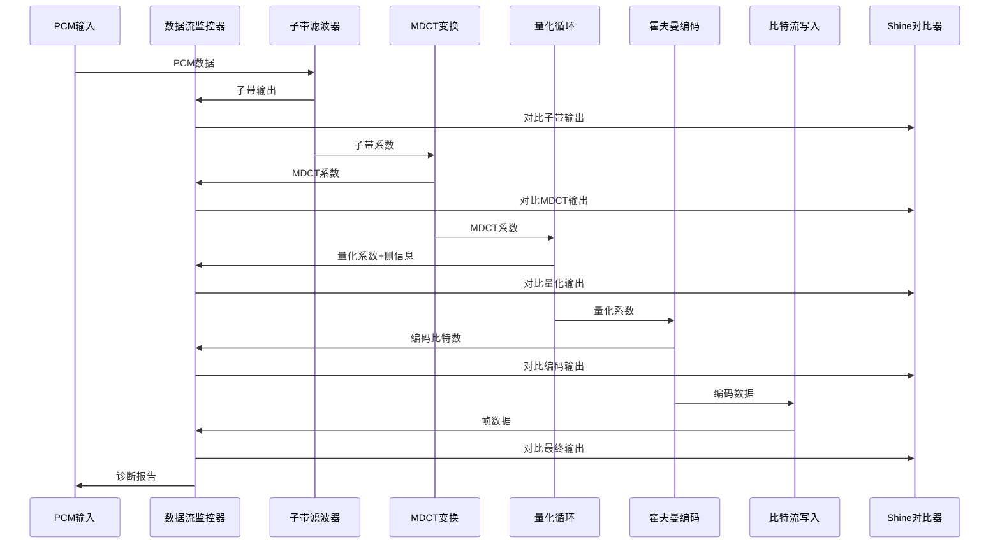
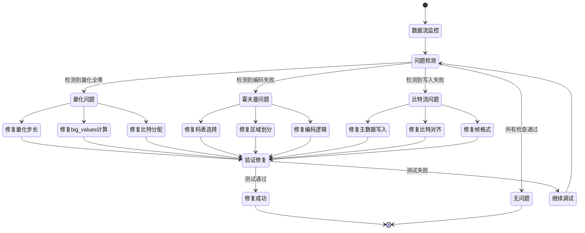

# 设计文档

## 概述

本设计文档描述了修复Rust MP3编码器音频数据编码问题的技术方案。当前编码器存在严重问题：生成的MP3文件主数据区域几乎全是零，导致音频无法正常播放。

**核心原则：严格遵循shine原始实现**

本项目是shine MP3编码器的Rust语言转换，不是重新设计。所有修复工作必须：
1. **严格对应shine源码结构** - 每个函数、数据结构、算法流程都必须与`ref/shine/src/lib/`中的C实现完全对应
2. **保持算法逻辑一致** - 不允许"优化"或"改进"shine的原始逻辑，只能进行语言转换
3. **数值计算精确匹配** - 所有数学计算、查找表、常量值都必须与shine完全一致
4. **函数调用顺序一致** - 保持与shine相同的函数调用顺序和数据处理流程

修复策略是通过逐行对比shine源码，找出Rust实现中与C实现不一致的地方，然后严格按照shine的逻辑进行修正。

## 架构

### 问题诊断架构



### 修复策略架构



## 组件和接口

### 1. 数据流监控器 (DataFlowMonitor)

```rust
pub struct DataFlowMonitor {
    /// 启用详细日志
    verbose_logging: bool,
    /// 数据统计收集器
    stats_collector: StatsCollector,
    /// 与shine对比器
    shine_comparator: Option<ShineComparator>,
}

impl DataFlowMonitor {
    pub fn new(verbose: bool) -> Self;
    
    /// 监控子带滤波器输出
    pub fn monitor_subband_output(&mut self, output: &[i32; 32], channel: usize);
    
    /// 监控MDCT变换输出
    pub fn monitor_mdct_output(&mut self, coeffs: &[i32; 576], channel: usize, granule: usize);
    
    /// 监控量化循环输出
    pub fn monitor_quantization_output(&mut self, quantized: &[i32; 576], info: &GranuleInfo);
    
    /// 监控霍夫曼编码输出
    pub fn monitor_huffman_output(&mut self, encoded_bits: usize, main_data_bits: usize);
    
    /// 监控比特流写入
    pub fn monitor_bitstream_write(&mut self, frame_data: &[u8], main_data_start: usize, main_data_len: usize);
    
    /// 生成诊断报告
    pub fn generate_report(&self) -> DiagnosticReport;
}

#[derive(Debug)]
pub struct DiagnosticReport {
    pub subband_stats: SubbandStats,
    pub mdct_stats: MdctStats,
    pub quantization_stats: QuantizationStats,
    pub huffman_stats: HuffmanStats,
    pub bitstream_stats: BitstreamStats,
    pub problems_detected: Vec<ProblemReport>,
}
```

### 2. Shine参考对比器 (ShineComparator)

```rust
pub struct ShineComparator {
    /// shine可执行文件路径
    shine_path: PathBuf,
    /// 临时文件管理器
    temp_manager: TempFileManager,
}

impl ShineComparator {
    pub fn new(shine_path: PathBuf) -> Result<Self, ComparisonError>;
    
    /// 对比子带滤波器输出
    pub fn compare_subband_output(&self, our_output: &[i32; 32], input_pcm: &[i16]) -> ComparisonResult;
    
    /// 对比MDCT变换输出
    pub fn compare_mdct_output(&self, our_coeffs: &[i32; 576], input_subband: &[[i32; 32]; 36]) -> ComparisonResult;
    
    /// 对比量化循环输出
    pub fn compare_quantization_output(&self, our_quantized: &[i32; 576], our_info: &GranuleInfo, input_mdct: &[i32; 576]) -> ComparisonResult;
    
    /// 对比最终MP3输出
    pub fn compare_mp3_output(&self, our_mp3: &[u8], input_wav: &[i16]) -> ComparisonResult;
}

#[derive(Debug)]
pub struct ComparisonResult {
    pub similarity_score: f64,  // 0.0 - 1.0
    pub max_difference: f64,
    pub differences: Vec<DifferenceReport>,
    pub is_acceptable: bool,
}
```

### 3. 量化循环 (QuantizationLoop)

```rust
/// 对应shine的量化循环实现
/// 对应文件: ref/shine/src/lib/l3loop.c
pub struct QuantizationLoop {
    /// 量化步长表 (对应shine的steptab)
    steptab: [f64; 256],
    /// 整数量化步长表 (对应shine的steptabi)  
    steptabi: [i32; 256],
    /// 整数到索引查找表 (对应shine的int2idx)
    int2idx: [i32; 10000],
    /// 调试监控器 (仅用于诊断，不影响算法)
    monitor: Option<DataFlowMonitor>,
}

impl QuantizationLoop {
    /// 对应shine的shine_loop_initialise函数
    pub fn shine_loop_initialise(&mut self);
    
    /// 对应shine的shine_iteration_loop函数
    pub fn shine_iteration_loop(&mut self, config: &mut ShineGlobalConfig);
    
    /// 对应shine的shine_outer_loop函数
    /// 严格按照shine/src/lib/l3loop.c:67-85实现
    pub fn shine_outer_loop(
        &self,
        max_bits: i32,
        l3_xmin: &ShinePsyXmin,
        ix: &mut [i32; 576],
        gr: i32,
        ch: i32,
        config: &mut ShineGlobalConfig
    ) -> i32;
    
    /// 对应shine的shine_inner_loop函数
    /// 严格按照shine/src/lib/l3loop.c:44-65实现
    pub fn shine_inner_loop(
        &self,
        ix: &mut [i32; 576],
        max_bits: i32,
        cod_info: &mut GrInfo,
        gr: i32,
        ch: i32,
        config: &mut ShineGlobalConfig
    ) -> i32;
    
    /// 对应shine的bin_search_StepSize函数
    fn bin_search_step_size(
        &self,
        desired_rate: i32,
        ix: &mut [i32; 576],
        cod_info: &mut GrInfo,
        config: &mut ShineGlobalConfig
    ) -> i32;
    
    /// 对应shine的quantize函数
    fn quantize(
        &self,
        ix: &mut [i32; 576],
        stepsize: i32,
        config: &mut ShineGlobalConfig
    ) -> i32;
    
    /// 对应shine的calc_runlen函数
    fn calc_runlen(&self, ix: &[i32; 576], cod_info: &mut GrInfo);
    
    /// 对应shine的subdivide函数
    fn subdivide(&self, cod_info: &mut GrInfo, config: &ShineGlobalConfig);
}

/// 对应shine的gr_info结构体
/// 必须与shine/src/lib/types.h中的定义完全一致
#[derive(Debug, Clone)]
pub struct GrInfo {
    pub part2_3_length: i32,
    pub big_values: i32,
    pub count1: i32,
    pub global_gain: i32,
    pub scalefac_compress: i32,
    pub table_select: [i32; 3],
    pub region0_count: i32,
    pub region1_count: i32,
    pub preflag: i32,
    pub scalefac_scale: i32,
    pub count1table_select: i32,
    pub part2_length: i32,
    pub sfb_lmax: i32,
    pub address1: i32,
    pub address2: i32,
    pub address3: i32,
    pub quantizer_step_size: i32,  // Rust snake_case命名
}
```
```

### 4. 霍夫曼编码器 (HuffmanEncoder)

```rust
/// 对应shine的霍夫曼编码器实现
/// 对应文件: ref/shine/src/lib/huffman.c
pub struct HuffmanEncoder {
    /// 霍夫曼码表 (对应shine的huffman tables)
    tables: &'static [HuffmanTable; 34],
    /// count1码表 (对应shine的count1 tables)
    count1_tables: &'static [HuffmanTable; 2],
    /// 调试监控器 (仅用于诊断，不影响算法)
    monitor: Option<DataFlowMonitor>,
}

impl HuffmanEncoder {
    /// 对应shine的bigv_bitcount函数
    /// 严格按照shine/src/lib/l3loop.c:693-704实现
    pub fn bigv_bitcount(&self, ix: &[i32; 576], gi: &GrInfo) -> i32;
    
    /// 对应shine的count_bit函数
    fn count_bit(&self, ix: &[i32; 576], start: u32, end: u32, table: u32) -> i32;
    
    /// 对应shine的count1_bitcount函数
    pub fn count1_bitcount(&self, ix: &[i32; 576], cod_info: &mut GrInfo) -> i32;
    
    /// 对应shine的bigv_tab_select函数
    pub fn bigv_tab_select(&self, ix: &[i32; 576], cod_info: &mut GrInfo);
    
    /// 对应shine的new_choose_table函数
    fn new_choose_table(&self, ix: &[i32; 576], begin: u32, end: u32) -> i32;
    
    /// 对应shine的subdivide函数
    pub fn subdivide(&self, cod_info: &mut GrInfo, config: &ShineGlobalConfig);
    
    /// 对应shine的calc_runlen函数
    pub fn calc_runlen(&self, ix: &[i32; 576], cod_info: &mut GrInfo);
    
    /// 霍夫曼编码写入函数
    pub fn encode_huffman_data(
        &self,
        ix: &[i32; 576],
        cod_info: &GrInfo,
        bitstream: &mut BitstreamWriter
    ) -> Result<i32, HuffmanError>;
}

/// 对应shine的HuffmanTable结构
#[derive(Debug)]
pub struct HuffmanTable {
    pub codes: &'static [u32],
    pub lengths: &'static [u8],
    pub max_value: u32,
}
```
```

### 5. 比特流写入器 (BitstreamWriter)

```rust
/// 对应shine的比特流写入器实现
/// 对应文件: ref/shine/src/lib/bitstream.c 和 ref/shine/src/lib/l3bitstream.c
pub struct BitstreamWriter {
    /// 比特缓存 (对应shine的buffer)
    buffer: Vec<u8>,
    /// 当前比特位置 (对应shine的bit position)
    bit_position: usize,
    /// 缓存字 (对应shine的cache)
    cache: u32,
    /// 缓存中的比特数 (对应shine的cache bits)
    cache_bits: u8,
    /// 调试监控器 (仅用于诊断，不影响算法)
    monitor: Option<DataFlowMonitor>,
}

impl BitstreamWriter {
    /// 对应shine的shine_putbits函数
    pub fn shine_putbits(&mut self, value: u32, bits: u8);
    
    /// 对应shine的shine_format_bitstream函数
    pub fn shine_format_bitstream(
        &mut self,
        config: &ShineGlobalConfig,
        side_info: &ShineSideInfo,
        main_data: &[u8]
    ) -> Result<Vec<u8>, BitstreamError>;
    
    /// 对应shine的shine_write_frame_header函数
    fn shine_write_frame_header(&mut self, config: &ShineGlobalConfig, padding: bool);
    
    /// 对应shine的shine_write_side_info函数
    fn shine_write_side_info(&mut self, side_info: &ShineSideInfo, config: &ShineGlobalConfig);
    
    /// 对应shine的shine_write_main_data函数
    fn shine_write_main_data(&mut self, main_data: &[u8], main_data_bits: usize);
    
    /// 对应shine的比特流刷新函数
    pub fn flush_bits(&mut self) -> &[u8];
}

/// 对应shine的shine_side_info_t结构体
/// 必须与shine/src/lib/types.h中的定义完全一致
#[derive(Debug, Clone)]
pub struct ShineSideInfo {
    pub private_bits: u32,
    pub scfsi: [[i32; 4]; 2],  // [channel][scfsi_band]
    pub gr: [ShineGranule; 2],  // [granule]
}

#[derive(Debug, Clone)]
pub struct ShineGranule {
    pub ch: [ShineChannel; 2],  // [channel]
}

#[derive(Debug, Clone)]
pub struct ShineChannel {
    pub tt: GrInfo,  // 对应shine的gr_info
}
```
```

## 数据模型

### 诊断数据流



### 问题检测和修复流程



## 正确性属性

*属性是一个特征或行为，应该在系统的所有有效执行中保持为真——本质上是关于系统应该做什么的正式陈述。属性作为人类可读规范和机器可验证正确性保证之间的桥梁。*

基于预工作分析，我将验收标准转换为可测试的正确性属性：

### 属性 1: 数据流完整性保持
*对于任何*非零PCM输入数据，编码流水线的每个阶段都应该保持数据的非零特性，直到最终的MP3输出包含非零的主数据
**验证需求: 1.1, 1.2, 1.3, 1.4, 1.5**

### 属性 2: 量化循环数据保持性
*对于任何*包含非零MDCT系数的输入，量化循环应该产生至少部分非零的量化系数，除非输入信号确实是静音
**验证需求: 2.1, 2.2, 2.3**

### 属性 3: 量化参数shine兼容性
*对于任何*相同的输入MDCT系数，我们的量化循环计算的全局增益和big_values边界应该与shine库的计算结果在可接受范围内一致
**验证需求: 2.4, 2.5**

### 属性 4: 霍夫曼编码数据生成性
*对于任何*包含非零量化系数的输入，霍夫曼编码器应该生成相应数量的编码比特，比特数应该与系数的非零数量和值相关
**验证需求: 3.1, 3.2, 3.3**

### 属性 5: 霍夫曼编码shine兼容性
*对于任何*相同的量化系数输入，我们的霍夫曼编码器选择的码表和生成的编码应该与shine库兼容
**验证需求: 3.4, 3.5**

### 属性 6: 比特流主数据非零性
*对于任何*包含非零霍夫曼编码数据的输入，比特流写入器生成的MP3帧的主数据区域应该包含非零字节
**验证需求: 4.1, 4.2**

### 属性 7: 比特流格式正确性
*对于任何*编码数据输入，比特流写入器应该生成正确大小的帧，正确处理比特对齐，并在需要时添加适当填充
**验证需求: 4.3, 4.4, 4.5**

### 属性 8: 逐阶段shine数值一致性
*对于任何*相同的输入数据，我们实现的每个编码阶段（子带、MDCT、量化、霍夫曼）的输出应该与shine库的输出在数值上接近或兼容
**验证需求: 5.1, 5.2, 5.3, 5.4, 5.5**

### 属性 9: 音频质量保持性
*对于任何*有效的音频输入，修复后的编码器应该保持音频的基本特征（音量水平、频谱内容），生成的MP3应该能被标准解码器正确解码
**验证需求: 8.2, 8.4**

## 错误处理

### 问题检测和分类

```rust
#[derive(Debug, Clone)]
pub enum AudioDataProblem {
    /// 量化循环问题
    QuantizationIssue {
        problem_type: QuantizationProblemType,
        severity: ProblemSeverity,
        details: String,
    },
    
    /// 霍夫曼编码问题
    HuffmanIssue {
        problem_type: HuffmanProblemType,
        severity: ProblemSeverity,
        details: String,
    },
    
    /// 比特流写入问题
    BitstreamIssue {
        problem_type: BitstreamProblemType,
        severity: ProblemSeverity,
        details: String,
    },
    
    /// 数据流中断问题
    DataFlowInterruption {
        stage: EncodingStage,
        expected_nonzero: usize,
        actual_nonzero: usize,
    },
}

#[derive(Debug, Clone)]
pub enum QuantizationProblemType {
    AllZeroOutput,
    ExcessiveStepSize,
    InvalidBigValues,
    IncorrectGlobalGain,
    BitAllocationFailure,
}

#[derive(Debug, Clone)]
pub enum HuffmanProblemType {
    ZeroEncodingOutput,
    InvalidTableSelection,
    RegionBoundaryError,
    Count1RegionError,
    EncodingLogicError,
}

#[derive(Debug, Clone)]
pub enum BitstreamProblemType {
    AllZeroMainData,
    FrameSizeError,
    BitAlignmentError,
    MainDataWriteFailure,
    PaddingError,
}
```

### 自动修复策略

```rust
pub struct AutoRepairStrategy {
    /// 量化循环修复器
    quantization_repairer: QuantizationRepairer,
    /// 霍夫曼编码修复器
    huffman_repairer: HuffmanRepairer,
    /// 比特流写入修复器
    bitstream_repairer: BitstreamRepairer,
}

impl AutoRepairStrategy {
    /// 尝试自动修复检测到的问题
    pub fn attempt_repair(&mut self, problem: &AudioDataProblem) -> RepairResult;
    
    /// 验证修复效果
    pub fn validate_repair(&self, original_problem: &AudioDataProblem) -> ValidationResult;
}

#[derive(Debug)]
pub enum RepairResult {
    Success { description: String },
    PartialSuccess { fixed: Vec<String>, remaining: Vec<String> },
    Failed { reason: String, suggestions: Vec<String> },
}
```

## 测试策略

### 双重测试方法

我们将采用单元测试和基于属性的测试相结合的方法：

**单元测试**:
- 验证特定的问题场景和边界情况
- 测试与shine库的具体数值对比
- 验证修复策略的有效性
- 测试已知的回归案例

**基于属性的测试**:
- 验证跨所有输入的通用属性
- 通过随机化实现全面的输入覆盖
- 每个属性测试最少运行 100 次迭代
- 每个正确性属性都有对应的属性测试

### 测试框架配置

我们将使用以下 Rust 测试框架：
- **proptest**: 用于基于属性的测试
- **criterion**: 用于性能基准测试
- **tempfile**: 用于临时文件管理（与shine对比）

### 属性测试标记格式

每个属性测试必须使用以下注释格式标记：
```rust
// Feature: mp3-audio-data-encoding-fix, Property 1: 数据流完整性保持
#[proptest]
fn test_data_flow_integrity_preservation(pcm_data in non_zero_pcm_strategy()) {
    // 测试实现
}
```

### 测试数据生成策略

**智能生成器**:
- **非零PCM生成器**: 生成各种非零音频信号（正弦波、噪声、音乐片段）
- **MDCT系数生成器**: 生成各种频域系数分布
- **边界条件生成器**: 生成极端情况的测试数据
- **Shine对比生成器**: 生成与shine库对比的测试用例

**测试音频库**:
- 纯音调（正弦波、方波、锯齿波）
- 白噪声和粉红噪声
- 静音和极低音量音频
- 真实音乐片段（用于回归测试）
- 极端动态范围的音频

### 诊断和调试测试

**数据流追踪测试**:
- 逐阶段数据完整性验证
- 与shine库的数值对比测试
- 问题检测器的准确性测试
- 修复策略的有效性测试

**性能和质量测试**:
- 编码速度回归测试
- 音频质量指标测试
- 内存使用监控测试
- 与多种解码器的兼容性测试

### 回归测试

**测试套件**:
- 已知问题的回归测试用例
- 与shine库输出的逐位比较测试
- 多种音频格式和参数的组合测试
- 自动化的问题检测和修复验证

每个测试都必须通过才能确认修复成功，确保不会引入新的问题。