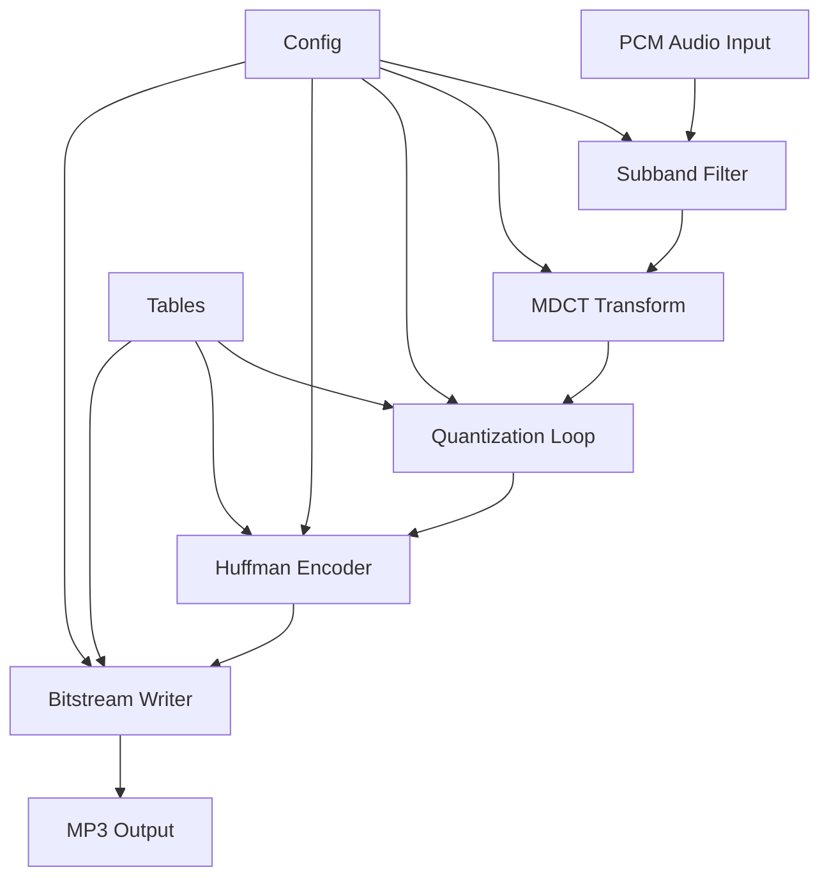
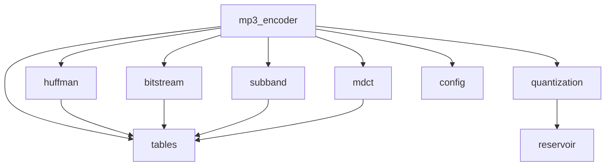
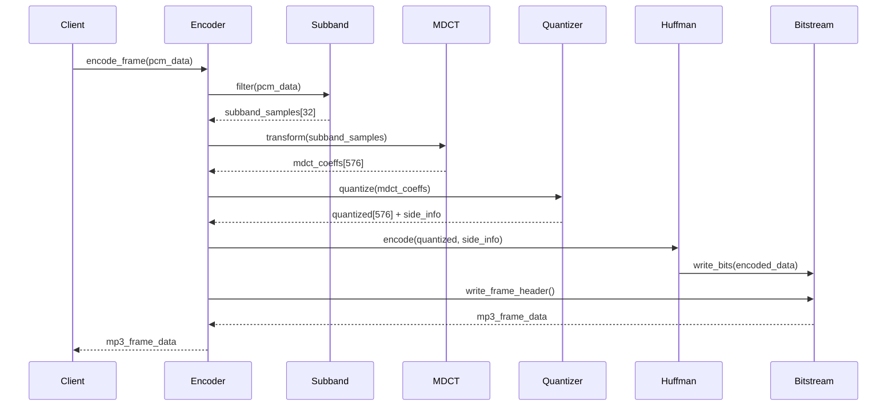

# 设计文档

## 概述

本设计文档描述了用 Rust 重写 shine MP3 编码器的架构设计。该编码器将实现完整的 MP3 Layer III 编码功能，保持与原始 shine 库相似的模块化架构，同时利用 Rust 的类型安全和性能优势。

编码器采用经典的 MP3 编码流水线：PCM 输入 → 子带滤波 → MDCT 变换 → 量化循环 → 霍夫曼编码 → 比特流输出。

## 架构

### 整体架构图



### 模块依赖关系



## 组件和接口

### 1. 核心编码器 (mp3_encoder)

```rust
pub struct Mp3Encoder {
    config: Config,
    subband: SubbandFilter,
    mdct: MdctTransform,
    quantizer: QuantizationLoop,
    huffman: HuffmanEncoder,
    bitstream: BitstreamWriter,
    buffer: Vec<Vec<i16>>, // [channel][samples]
    frame_buffer: Vec<u8>,
}

impl Mp3Encoder {
    pub fn new(config: Config) -> Result<Self, EncoderError>;
    pub fn encode_frame(&mut self, pcm_data: &[i16]) -> Result<&[u8], EncoderError>;
    pub fn encode_frame_interleaved(&mut self, pcm_data: &[i16]) -> Result<&[u8], EncoderError>;
    pub fn flush(&mut self) -> Result<&[u8], EncoderError>;
    pub fn samples_per_frame(&self) -> usize;
}
```

### 2. 配置管理 (config)

```rust
#[derive(Debug, Clone)]
pub struct Config {
    pub wave: WaveConfig,
    pub mpeg: MpegConfig,
}

#[derive(Debug, Clone)]
pub struct WaveConfig {
    pub channels: Channels,
    pub sample_rate: u32,
}

#[derive(Debug, Clone)]
pub struct MpegConfig {
    pub mode: StereoMode,
    pub bitrate: u32,
    pub emphasis: Emphasis,
    pub copyright: bool,
    pub original: bool,
}

#[derive(Debug, Clone, Copy)]
pub enum Channels { Mono = 1, Stereo = 2 }

#[derive(Debug, Clone, Copy)]
pub enum StereoMode { Stereo, JointStereo, DualChannel, Mono }

impl Config {
    pub fn new() -> Self;
    pub fn validate(&self) -> Result<(), ConfigError>;
    pub fn mpeg_version(&self) -> MpegVersion;
    pub fn samples_per_frame(&self) -> usize;
}
```

### 3. 子带滤波器 (subband)

```rust
pub struct SubbandFilter {
    filter_bank: [i32; 512],
    history: Vec<Vec<i32>>, // [channel][history]
    offset: Vec<usize>,     // [channel]
}

impl SubbandFilter {
    pub fn new(channels: usize) -> Self;
    pub fn filter(&mut self, pcm_samples: &[i16], output: &mut [i32; 32], channel: usize);
    pub fn reset(&mut self);
}
```

### 4. MDCT 变换 (mdct)

```rust
pub struct MdctTransform {
    cos_table: [[i32; 36]; 18],
    window_coeffs: [i32; 36],
}

impl MdctTransform {
    pub fn new() -> Self;
    pub fn transform(&self, subband_samples: &[[i32; 32]; 36], output: &mut [i32; 576]);
    pub fn apply_aliasing_reduction(&self, coeffs: &mut [i32; 576]);
}
```

### 5. 量化循环 (quantization)

```rust
pub struct QuantizationLoop {
    step_table: [f32; 128],
    step_table_i32: [i32; 128],
    int2idx: [u32; 10000],
    reservoir: BitReservoir,
}

impl QuantizationLoop {
    pub fn new() -> Self;
    pub fn quantize_and_encode(
        &mut self,
        mdct_coeffs: &[i32; 576],
        max_bits: usize,
        side_info: &mut GranuleInfo,
        output: &mut [i32; 576]
    ) -> Result<usize, QuantizationError>;
    
    fn inner_loop(&self, coeffs: &mut [i32; 576], max_bits: usize, info: &mut GranuleInfo) -> usize;
    fn outer_loop(&self, coeffs: &mut [i32; 576], max_bits: usize, info: &mut GranuleInfo) -> usize;
}

pub struct BitReservoir {
    size: usize,
    max_size: usize,
}
```

### 6. 霍夫曼编码器 (huffman)

```rust
pub struct HuffmanEncoder {
    tables: &'static [HuffmanTable; 32],
    count1_tables: &'static [HuffmanTable; 2],
}

impl HuffmanEncoder {
    pub fn new() -> Self;
    pub fn encode_big_values(
        &self,
        quantized: &[i32; 576],
        info: &GranuleInfo,
        output: &mut BitstreamWriter
    ) -> Result<usize, HuffmanError>;
    
    pub fn encode_count1(
        &self,
        quantized: &[i32; 576],
        info: &GranuleInfo,
        output: &mut BitstreamWriter
    ) -> Result<usize, HuffmanError>;
    
    fn select_table(&self, values: &[i32], start: usize, end: usize) -> usize;
}

#[derive(Debug)]
pub struct HuffmanTable {
    pub codes: &'static [u32],
    pub lengths: &'static [u8],
    pub max_value: u32,
}
```

### 7. 比特流写入器 (bitstream)

```rust
pub struct BitstreamWriter {
    buffer: Vec<u8>,
    cache: u32,
    cache_bits: u8,
    position: usize,
}

impl BitstreamWriter {
    pub fn new(capacity: usize) -> Self;
    pub fn write_bits(&mut self, value: u32, bits: u8);
    pub fn write_frame_header(&mut self, config: &Config, padding: bool);
    pub fn write_side_info(&mut self, side_info: &SideInfo, config: &Config);
    pub fn flush(&mut self) -> &[u8];
    pub fn reset(&mut self);
    pub fn bits_written(&self) -> usize;
}
```

### 8. 数据结构

```rust
#[derive(Debug, Clone)]
pub struct SideInfo {
    pub private_bits: u32,
    pub scfsi: [[bool; 4]; 2], // [channel][band]
    pub granules: [GranuleInfo; 4], // [granule * channel]
}

#[derive(Debug, Clone)]
pub struct GranuleInfo {
    pub part2_3_length: u32,
    pub big_values: u32,
    pub global_gain: u32,
    pub scalefac_compress: u32,
    pub table_select: [u32; 3],
    pub region0_count: u32,
    pub region1_count: u32,
    pub preflag: bool,
    pub scalefac_scale: bool,
    pub count1table_select: bool,
    pub quantizer_step_size: i32,
}
```

## 数据模型

### 音频数据流



### 内存布局优化

- **固定大小数组**: 使用编译时已知大小的数组避免动态分配
- **缓存友好**: 数据结构按访问模式排列以提高缓存命中率
- **SIMD 对齐**: 关键数据结构按 16/32 字节对齐以支持 SIMD 优化

## 正确性属性

*属性是一个特征或行为，应该在系统的所有有效执行中保持为真——本质上是关于系统应该做什么的正式陈述。属性作为人类可读规范和机器可验证正确性保证之间的桥梁。*

现在我需要使用 prework 工具来分析验收标准的可测试性：

基于预工作分析，我将验收标准转换为可测试的正确性属性：

### 属性 1: 编码器初始化和基本功能
*对于任何*有效的编码配置，编码器应该能够成功初始化，并且对于任何有效的 PCM 输入数据，应该返回有效的 MP3 编码数据
**验证需求: 1.1, 1.2**

### 属性 2: 刷新和完整性
*对于任何*编码会话，调用刷新方法应该返回所有剩余的编码数据，确保没有数据丢失
**验证需求: 1.3**

### 属性 3: 音频格式支持
*对于任何*标准的音频格式配置（单声道/立体声，标准采样率，标准比特率），编码器应该能够正确处理
**验证需求: 1.4, 1.5, 1.6**

### 属性 4: 子带滤波器输出
*对于任何*PCM 输入数据，子带滤波器应该输出正好 32 个子带，并且对于立体声数据，左右声道应该独立处理
**验证需求: 2.1, 2.3**

### 属性 5: 与参考实现一致性
*对于任何*相同的输入数据和配置，我们的实现应该与 shine 库产生相同或等效的输出结果
**验证需求: 2.4, 10.3**

### 属性 6: MDCT 变换正确性
*对于任何*子带输入数据，MDCT 变换应该产生正好 576 个频域系数，并且对于立体声数据，左右声道应该独立处理
**验证需求: 3.1, 3.2, 3.3**

### 属性 7: 量化和比特率控制
*对于任何*MDCT 系数和目标比特率，量化循环应该调整量化步长以满足比特率约束，当比特数超过目标时增加步长，当比特数低于目标时减少步长
**验证需求: 4.1, 4.2, 4.3, 4.4**

### 属性 8: 比特储备池机制
*对于任何*编码会话，比特储备池应该正确分配和管理可用比特，在帧之间平衡比特分配
**验证需求: 4.5**

### 属性 9: 霍夫曼编码正确性
*对于任何*量化系数，霍夫曼编码器应该使用适当的标准 MP3 霍夫曼表进行编码，对于大值使用转义序列，并选择最优码表以最小化比特数
**验证需求: 5.1, 5.2, 5.3, 5.4**

### 属性 10: 比特流格式正确性
*对于任何*编码数据，比特流写入器应该生成包含正确帧头的标准 MP3 格式，支持所有 MPEG 版本，正确写入侧信息，并在需要时添加填充位
**验证需求: 6.1, 6.2, 6.3, 6.5**

### 属性 11: CRC 校验正确性
*对于任何*启用 CRC 的编码，比特流应该包含正确的 CRC 校验值
**验证需求: 6.4**

### 属性 12: 配置管理完整性
*对于任何*有效的配置参数组合，配置系统应该正确设置和验证所有参数，对于无效配置应该返回适当的错误信息
**验证需求: 7.1, 7.2, 7.3, 7.4, 7.5**

### 属性 13: 内存使用稳定性
*对于任何*长时间的编码会话，编码器应该保持稳定的内存使用，避免不必要的内存分配
**验证需求: 8.2, 8.3**

### 属性 14: 性能优化有效性
*对于任何*相同的输入，使用固定点算术和 SIMD 优化的实现应该比浮点实现更快
**验证需求: 8.4, 8.5**

### 属性 15: 错误处理完整性
*对于任何*错误情况（无效配置、错误数据格式等），编码器应该返回适当的错误类型和详细信息，并保持内部状态一致性
**验证需求: 9.1, 9.2, 9.4, 9.5**

### 属性 16: 标准兼容性
*对于任何*编码输出，生成的 MP3 文件应该符合 ISO/IEC 11172-3 标准，能被标准 MP3 解码器正确解码，并且所有元数据应该被正确识别
**验证需求: 10.1, 10.2, 10.5**

## 错误处理

### 错误类型层次结构

```rust
#[derive(Debug, thiserror::Error)]
pub enum EncoderError {
    #[error("Configuration error: {0}")]
    Config(#[from] ConfigError),
    
    #[error("Input data error: {0}")]
    InputData(#[from] InputDataError),
    
    #[error("Encoding error: {0}")]
    Encoding(#[from] EncodingError),
    
    #[error("Memory allocation error")]
    Memory,
    
    #[error("Internal state error: {0}")]
    InternalState(String),
}

#[derive(Debug, thiserror::Error)]
pub enum ConfigError {
    #[error("Unsupported sample rate: {0}")]
    UnsupportedSampleRate(u32),
    
    #[error("Unsupported bitrate: {0}")]
    UnsupportedBitrate(u32),
    
    #[error("Invalid channel configuration")]
    InvalidChannels,
    
    #[error("Incompatible sample rate and bitrate combination")]
    IncompatibleRateCombination,
}

#[derive(Debug, thiserror::Error)]
pub enum InputDataError {
    #[error("Invalid PCM data length: expected {expected}, got {actual}")]
    InvalidLength { expected: usize, actual: usize },
    
    #[error("Invalid channel count in PCM data")]
    InvalidChannelCount,
    
    #[error("PCM data contains invalid samples")]
    InvalidSamples,
}
```

### 错误恢复策略

1. **配置错误**: 在初始化时检测，返回详细错误信息
2. **输入数据错误**: 验证输入数据格式和长度，提供修正建议
3. **编码错误**: 在编码过程中检测，尝试降级处理或跳过有问题的帧
4. **内存错误**: 使用 Rust 的 Result 类型处理，避免 panic
5. **状态一致性**: 在错误发生后重置内部状态到已知良好状态

## 测试策略

### 双重测试方法

我们将采用单元测试和基于属性的测试相结合的方法：

**单元测试**:
- 验证特定示例和边界情况
- 测试组件之间的集成点
- 验证错误条件和异常处理
- 测试已知的回归案例

**基于属性的测试**:
- 验证跨所有输入的通用属性
- 通过随机化实现全面的输入覆盖
- 每个属性测试最少运行 100 次迭代
- 每个正确性属性都有对应的属性测试

### 测试框架配置

我们将使用以下 Rust 测试框架：
- **proptest**: 用于基于属性的测试
- **criterion**: 用于性能基准测试
- **quickcheck**: 作为 proptest 的补充

### 属性测试标记格式

每个属性测试必须使用以下注释格式标记：
```rust
// Feature: rust-mp3-encoder, Property 1: 编码器初始化和基本功能
#[proptest]
fn test_encoder_initialization_and_basic_functionality(config in valid_config_strategy()) {
    // 测试实现
}
```

### 测试数据生成策略

**智能生成器**:
- **音频数据生成器**: 生成各种频率、幅度和相位的测试音频
- **配置生成器**: 生成所有有效的配置组合
- **边界值生成器**: 专门生成边界和极端情况的数据
- **错误情况生成器**: 生成各种无效输入以测试错误处理

**测试音频库**:
- 纯音调（正弦波、方波、锯齿波）
- 白噪声和粉红噪声
- 静音和削波音频
- 真实音乐片段（用于回归测试）

### 性能测试

**基准测试指标**:
- 编码速度（实时倍数）
- 内存使用量
- CPU 使用率
- 与 shine 库的性能对比

**测试环境**:
- 不同架构（x86_64, ARM64）
- 不同优化级别（debug, release）
- 不同 SIMD 指令集（SSE, AVX, NEON）

### 兼容性测试

**解码器兼容性**:
- FFmpeg/libmp3lame
- Windows Media Player
- VLC Media Player
- 移动设备播放器

**标准符合性**:
- MP3 格式验证工具
- 比特流分析器
- 频谱分析对比

### 回归测试

**测试套件**:
- 与 shine 库输出的逐位比较
- 已知问题的回归测试用例
- 性能回归检测
- 内存泄漏检测

每个测试都必须通过才能合并代码，确保实现的正确性和稳定性。